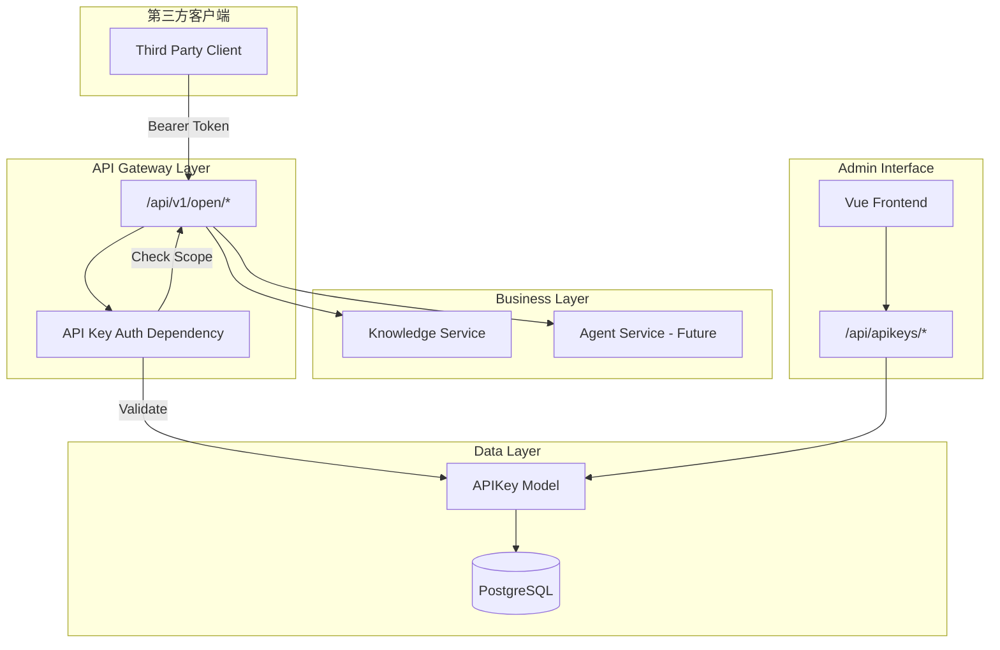

# Design Document: API Key Authentication

## Overview

本设计文档描述基于 API Key 的第三方认证机制的技术实现方案。该系统允许管理员创建和管理 API Key，使第三方应用能够通过 API Key 安全地访问开放接口。

系统采用以下核心设计原则：
- **安全性**：API Key 仅存储哈希值，明文仅在创建时返回一次
- **可扩展性**：权限范围使用 JSON 数组存储，支持动态扩展
- **统一性**：所有开放接口使用统一的路由前缀和认证机制

## Architecture

本设计遵循以下原则：
- **单一职责原则 (SRP)**: 每个模块只负责一个功能
- **模块化**: 将系统拆分为独立的功能模块
- **高内聚，低耦合**: 模块内部逻辑紧密，模块间通过定义好的接口通信



### 模块划分

| 模块 | 职责 | 文件位置 |
|-----|------|---------|
| APIKey Model | 数据模型定义 | `src/storage/postgres/models_business.py` |
| APIKey Service | API Key 业务逻辑 | `src/services/apikey_service.py` |
| APIKey Router | 管理接口路由 | `server/routers/apikey_router.py` |
| Open API Router | 开放接口路由 | `server/routers/open_api_router.py` |
| Auth Dependency | 认证依赖注入 | `server/utils/apikey_auth.py` |
| Frontend API | 前端 API 调用 | `web/src/apis/apikey_api.js` |
| Frontend Component | 管理界面组件 | `web/src/components/ApiKeyManagementComponent.vue` |

## Components and Interfaces

### 1. 数据模型 - APIKey

```python
class APIKey(Base):
    """API Key 模型"""
    __tablename__ = "api_keys"
    
    id = Column(Integer, primary_key=True, autoincrement=True)
    name = Column(String(100), nullable=False, comment="API Key 名称")
    description = Column(String(500), nullable=True, comment="描述")
    key_prefix = Column(String(10), nullable=False, index=True, comment="密钥前缀，用于识别")
    key_hash = Column(String(64), nullable=False, unique=True, comment="密钥哈希值")
    scopes = Column(JSON, nullable=False, default=list, comment="权限范围列表")
    is_active = Column(Integer, nullable=False, default=1, comment="是否启用")
    expires_at = Column(DateTime, nullable=True, comment="过期时间")
    last_used_at = Column(DateTime, nullable=True, comment="最后使用时间")
    created_by = Column(Integer, ForeignKey("users.id"), nullable=False, comment="创建者ID")
    created_at = Column(DateTime, default=utc_now_naive, comment="创建时间")
    updated_at = Column(DateTime, default=utc_now_naive, onupdate=utc_now_naive)
```

### 2. API Key 管理服务

```python
class APIKeyService:
    """API Key 管理服务"""
    
    async def create_api_key(
        self, 
        name: str, 
        description: str | None,
        scopes: list[str],
        expires_at: datetime | None,
        created_by: int
    ) -> tuple[APIKey, str]:
        """
        创建 API Key
        返回: (APIKey 对象, 明文密钥 - 仅此一次)
        """
        pass
    
    async def list_api_keys(self) -> list[APIKey]:
        """获取所有 API Key 列表"""
        pass
    
    async def get_api_key(self, key_id: int) -> APIKey | None:
        """获取单个 API Key"""
        pass
    
    async def update_api_key(
        self, 
        key_id: int, 
        name: str | None,
        description: str | None,
        scopes: list[str] | None,
        is_active: bool | None
    ) -> APIKey:
        """更新 API Key"""
        pass
    
    async def delete_api_key(self, key_id: int) -> bool:
        """删除 API Key"""
        pass
    
    async def validate_api_key(self, raw_key: str) -> APIKey | None:
        """
        验证 API Key
        返回: 有效的 APIKey 对象或 None
        """
        pass
    
    async def update_last_used(self, key_id: int) -> None:
        """更新最后使用时间"""
        pass
```

### 3. API Key 认证依赖

```python
async def get_api_key_auth(
    authorization: str = Header(None),
    required_scopes: list[str] = []
) -> APIKey:
    """
    FastAPI 依赖注入函数，用于验证 API Key
    
    Args:
        authorization: Authorization 头，格式为 "Bearer {api_key}"
        required_scopes: 该接口所需的权限范围
    
    Returns:
        验证通过的 APIKey 对象
    
    Raises:
        HTTPException 401: API Key 无效或过期
        HTTPException 403: API Key 已禁用或权限不足
    """
    pass

def require_scopes(*scopes: str):
    """
    装饰器工厂，用于指定接口所需的权限范围
    
    Usage:
        @router.get("/knowledge/list")
        async def list_kb(api_key: APIKey = Depends(require_scopes("knowledge:list"))):
            ...
    """
    pass
```

### 4. 开放 API 路由

```python
# server/routers/open_api_router.py
open_api = APIRouter(prefix="/v1/open", tags=["open-api"])

@open_api.get("/knowledge/databases")
async def list_knowledge_bases(
    api_key: APIKey = Depends(require_scopes("knowledge:list"))
) -> list[KnowledgeBaseInfo]:
    """获取知识库列表"""
    pass

@open_api.post("/knowledge/databases/{db_id}/query")
async def query_knowledge_base(
    db_id: str,
    query: str = Body(...),
    top_k: int = Body(5),
    api_key: APIKey = Depends(require_scopes("knowledge:read"))
) -> QueryResult:
    """查询知识库"""
    pass
```

### 5. 管理 API 路由

```python
# server/routers/apikey_router.py
apikey = APIRouter(prefix="/apikeys", tags=["api-keys"])

@apikey.post("")
async def create_api_key(
    data: APIKeyCreate,
    current_user: User = Depends(get_admin_user)
) -> APIKeyCreateResponse:
    """创建 API Key（返回明文密钥）"""
    pass

@apikey.get("")
async def list_api_keys(
    current_user: User = Depends(get_admin_user)
) -> list[APIKeyResponse]:
    """获取 API Key 列表"""
    pass

@apikey.put("/{key_id}")
async def update_api_key(
    key_id: int,
    data: APIKeyUpdate,
    current_user: User = Depends(get_admin_user)
) -> APIKeyResponse:
    """更新 API Key"""
    pass

@apikey.delete("/{key_id}")
async def delete_api_key(
    key_id: int,
    current_user: User = Depends(get_admin_user)
) -> dict:
    """删除 API Key"""
    pass

@apikey.put("/{key_id}/toggle")
async def toggle_api_key(
    key_id: int,
    current_user: User = Depends(get_admin_user)
) -> APIKeyResponse:
    """启用/禁用 API Key"""
    pass
```

## Data Models

### API Key 生成规则

```
格式: yk_{random_32_chars}
示例: yk_a1b2c3d4e5f6g7h8i9j0k1l2m3n4o5p6

存储:
- key_prefix: "yk_a1b2" (前8位，用于识别)
- key_hash: SHA256(full_key) (完整密钥的哈希值)
```

### 权限范围定义

```python
# 预定义权限范围
AVAILABLE_SCOPES = {
    "knowledge:list": "获取知识库列表",
    "knowledge:read": "查询知识库内容",
    # 未来扩展
    # "agent:invoke": "调用智能体",
    # "graph:query": "查询知识图谱",
}
```

### 请求/响应模型

```python
class APIKeyCreate(BaseModel):
    name: str
    description: str | None = None
    scopes: list[str]
    expires_days: int | None = None  # 过期天数，None 表示永不过期

class APIKeyCreateResponse(BaseModel):
    id: int
    name: str
    key: str  # 完整密钥，仅此一次返回
    key_prefix: str
    scopes: list[str]
    expires_at: str | None
    created_at: str

class APIKeyResponse(BaseModel):
    id: int
    name: str
    description: str | None
    key_prefix: str  # 仅返回前缀
    scopes: list[str]
    is_active: bool
    expires_at: str | None
    last_used_at: str | None
    created_at: str

class APIKeyUpdate(BaseModel):
    name: str | None = None
    description: str | None = None
    scopes: list[str] | None = None
```

## Correctness Properties

*A property is a characteristic or behavior that should hold true across all valid executions of a system-essentially, a formal statement about what the system should do. Properties serve as the bridge between human-readable specifications and machine-verifiable correctness guarantees.*

### Property 1: API Key 格式一致性
*For any* 创建的 API Key，其格式必须为 `yk_` 前缀加 32 位随机字符，且每个密钥都是唯一的。
**Validates: Requirements 1.2**

### Property 2: 密钥存储安全性
*For any* 存储在数据库中的 API Key 记录，key_hash 字段必须是原始密钥的 SHA256 哈希值，且数据库中不存储明文密钥。
**Validates: Requirements 1.4**

### Property 3: 明文密钥仅返回一次
*For any* API Key，创建时返回完整明文密钥，之后任何获取操作（列表、详情）都只返回 key_prefix 而非完整密钥。
**Validates: Requirements 1.3, 2.1, 2.3**

### Property 4: 有效密钥认证成功
*For any* 有效且启用的 API Key，使用 `Bearer {api_key}` 格式在 Authorization 头中携带时，应通过认证并允许访问。
**Validates: Requirements 5.1, 5.2**

### Property 5: 无效/删除密钥返回 401
*For any* 不存在、无效或已删除的 API Key，使用该密钥访问开放接口应返回 401 Unauthorized 错误。
**Validates: Requirements 3.2, 5.3**

### Property 6: 过期密钥返回 401
*For any* 已过期的 API Key，使用该密钥访问开放接口应返回 401 Unauthorized 错误，且错误信息说明密钥已过期。
**Validates: Requirements 5.4**

### Property 7: 禁用密钥返回 403
*For any* 已禁用的 API Key，使用该密钥访问开放接口应返回 403 Forbidden 错误。
**Validates: Requirements 4.2, 5.5**

### Property 8: 启用/禁用状态切换
*For any* API Key，禁用后 is_active 为 false 且无法访问接口，启用后 is_active 为 true 且可以正常访问。
**Validates: Requirements 4.1, 4.3**

### Property 9: 权限范围验证
*For any* API Key 和开放接口，如果该接口所需的权限范围不在 API Key 的 scopes 列表中，应返回 403 Forbidden 错误。
**Validates: Requirements 6.1.3**

### Property 10: 最后使用时间更新
*For any* 成功的 API Key 认证，该 API Key 的 last_used_at 字段应被更新为当前时间。
**Validates: Requirements 5.6**

### Property 11: 频率限制生效
*For any* API Key，在一分钟内超过最大请求数限制后，应返回 429 Too Many Requests 错误，且响应头包含 Retry-After 字段。
**Validates: Requirements 7.1, 7.2, 7.3**

### Property 12: 删除后数据清除
*For any* 被删除的 API Key，数据库中应不存在该记录。
**Validates: Requirements 3.1**

## Error Handling

### 认证错误

| 错误场景 | HTTP 状态码 | 错误信息 |
|---------|------------|---------|
| 缺少 Authorization 头 | 401 | Missing API key |
| Authorization 格式错误 | 401 | Invalid authorization format |
| API Key 不存在 | 401 | Invalid API key |
| API Key 已过期 | 401 | API key has expired |
| API Key 已禁用 | 403 | API key is disabled |
| 权限不足 | 403 | Insufficient permissions |
| 频率限制 | 429 | Rate limit exceeded |

### 业务错误

| 错误场景 | HTTP 状态码 | 错误信息 |
|---------|------------|---------|
| 知识库不存在 | 404 | Knowledge base not found |
| 查询参数无效 | 400 | Invalid query parameters |

## Testing Strategy

### 单元测试

1. **API Key 生成测试**
   - 验证密钥格式符合规范
   - 验证哈希值计算正确
   - 验证前缀提取正确

2. **权限验证测试**
   - 验证权限范围匹配逻辑
   - 验证权限不足时的错误处理

### 属性测试

使用 `hypothesis` 库进行属性测试，每个测试至少运行 100 次迭代。

1. **Property 1-3**: API Key 创建和存储安全性
2. **Property 4-7**: 认证状态验证
3. **Property 8-9**: 状态切换和权限验证
4. **Property 10-12**: 使用记录和删除

### 集成测试

1. **完整认证流程测试**
   - 创建 API Key → 使用密钥访问 → 验证成功
   - 创建 API Key → 禁用 → 验证拒绝 → 启用 → 验证成功
   - 创建 API Key → 删除 → 验证拒绝

2. **知识库查询测试**
   - 使用有效密钥查询知识库
   - 验证返回结果格式正确

