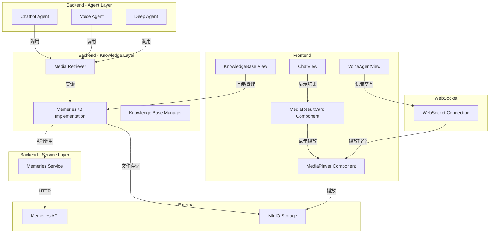

# Design Document: Video Knowledge Playback

## Overview

本设计文档描述音视频知识库播放功能的技术实现方案。该系统通过集成 Memeries API 实现音视频内容的语义分析和搜索，支持所有类型的智能体绑定媒体知识库，文字智能体通过聊天界面交互，语音智能体通过语音交互。

核心设计原则：
- **复用现有架构**：继承 KnowledgeBase 基类，复用检索器机制
- **单一职责**：Memeries Service 专注于 API 封装，知识库实现专注于数据管理
- **统一交互**：所有智能体使用相同的检索器接口

## Architecture



### 模块划分

| 模块 | 职责 | 文件位置 |
|-----|------|---------|
| MemeriesKB | 媒体知识库实现 | `src/knowledge/implementations/memeries.py` |
| MemeriesService | Memeries API 封装 | `src/services/memeries_service.py` |
| MediaPlayer | 前端播放器组件 | `web/src/components/MediaPlayer.vue` |
| MediaResultCard | 搜索结果卡片组件 | `web/src/components/ToolCallingResult/MediaResultCard.vue` |

## Components and Interfaces

### 1. Memeries Service

```python
# src/services/memeries_service.py

class MemeriesService:
    """Memeries API 封装服务"""
    
    def __init__(self):
        self.endpoint = os.getenv("MEMERIES_API_ENDPOINT", "https://api.memories.ai")
        self.api_key = os.getenv("MEMERIES_API_KEY")
    
    async def upload(
        self,
        file_path: str,
        file_data: bytes,
        unique_id: str,
        retain_original_video: bool = True
    ) -> dict:
        """
        上传媒体文件到 Memeries
        POST /serve/api/v1/upload
        
        Returns:
            {"videoNo": "VI...", "videoName": "...", "videoStatus": "UNPARSE"}
        """
        pass
    
    async def search(
        self,
        search_param: str,
        search_type: str,  # BY_VIDEO, BY_AUDIO
        unique_id: str,
        top_k: int = 5
    ) -> list[dict]:
        """
        语义搜索媒体内容
        POST /serve/api/v1/search
        
        Returns:
            [{"videoNo": "...", "startTime": "13", "endTime": "18", "score": 0.52}]
        """
        pass
    
    async def list_videos(
        self,
        unique_id: str,
        page: int = 1,
        size: int = 100,
        status: str | None = None
    ) -> dict:
        """
        获取视频列表
        POST /serve/api/v1/list_videos
        """
        pass
    
    async def get_video_details(
        self,
        video_no: str,
        unique_id: str
    ) -> dict:
        """
        获取视频详情
        GET /serve/api/v1/get_private_video_details
        
        Returns:
            {"duration": "8", "video_url": "...", "status": "PARSE", ...}
        """
        pass
    
    async def delete_videos(
        self,
        video_nos: list[str],
        unique_id: str
    ) -> bool:
        """
        删除视频（每次最多 100 个）
        POST /serve/api/v1/delete_videos
        """
        pass
```

### 2. Memeries Knowledge Base

```python
# src/knowledge/implementations/memeries.py

class MemeriesKB(KnowledgeBase):
    """基于 Memeries API 的媒体知识库实现"""
    
    SUPPORTED_VIDEO_FORMATS = {"mp4", "avi", "mov", "mkv", "webm"}
    SUPPORTED_AUDIO_FORMATS = {"mp3", "wav", "m4a", "flac", "aac", "ogg"}
    
    @property
    def kb_type(self) -> str:
        return "memeries"
    
    def _get_media_type(self, filename: str) -> str:
        """根据文件扩展名判断媒体类型"""
        ext = filename.rsplit(".", 1)[-1].lower()
        if ext in self.SUPPORTED_VIDEO_FORMATS:
            return "video"
        elif ext in self.SUPPORTED_AUDIO_FORMATS:
            return "audio"
        return "unknown"
    
    def _validate_file_format(self, filename: str) -> bool:
        """验证文件格式是否支持"""
        ext = filename.rsplit(".", 1)[-1].lower()
        return ext in (self.SUPPORTED_VIDEO_FORMATS | self.SUPPORTED_AUDIO_FORMATS)
    
    async def index_file(self, db_id: str, file_id: str, operator_id: str | None = None) -> dict:
        """
        上传文件到 Memeries 进行索引
        使用 db_id 作为 unique_id
        """
        pass
    
    async def aquery(self, query_text: str, db_id: str, agent_call: bool = False, **kwargs) -> list[dict]:
        """
        语义搜索媒体内容
        同时执行 BY_VIDEO 和 BY_AUDIO 搜索并合并结果
        
        Returns:
            [{"media_id": "VI...", "media_name": "...", "media_type": "video",
              "start_time": 13, "end_time": 18, "score": 0.52, "media_url": "..."}]
        """
        pass
    
    async def delete_file(self, db_id: str, file_id: str) -> None:
        """删除文件（同时删除 MinIO 和 Memeries 中的数据）"""
        pass
    
    def get_query_params_config(self, db_id: str, **kwargs) -> dict:
        """获取查询参数配置"""
        return {
            "type": "memeries",
            "options": [
                {
                    "key": "top_k",
                    "label": "返回数量",
                    "type": "number",
                    "default": 5,
                    "min": 1,
                    "max": 20
                }
            ]
        }
```

### 3. 播放指令协议

```python
# 播放指令数据模型
class MediaPlayCommand(BaseModel):
    action: str  # play, pause, seek, stop
    media_id: str
    media_type: str  # video, audio
    media_url: str
    start_time: float  # 秒
    end_time: float | None = None
    description: str | None = None

# WebSocket 消息格式
{
    "type": "media_command",
    "data": {
        "action": "play",
        "media_id": "VI123456",
        "media_type": "video",
        "media_url": "http://minio:9000/...",
        "start_time": 13,
        "end_time": 18,
        "description": "手术切口缝合片段"
    }
}
```

### 4. 前端组件

#### MediaPlayer.vue
```vue
<!-- web/src/components/MediaPlayer.vue -->
<template>
  <div class="media-player">
    <div v-if="description" class="description">{{ description }}</div>
    <video v-if="mediaType === 'video'" ref="mediaRef" :src="mediaUrl" controls />
    <audio v-else ref="mediaRef" :src="mediaUrl" controls />
  </div>
</template>

<script setup>
import { ref, watch, onMounted } from 'vue'

const props = defineProps({
  mediaUrl: String,
  mediaType: String,
  startTime: Number,
  description: String
})

const mediaRef = ref(null)

function seekAndPlay(time) {
  if (mediaRef.value) {
    mediaRef.value.currentTime = time
    mediaRef.value.play()
  }
}

watch(() => props.startTime, (newTime) => {
  if (newTime !== undefined) {
    seekAndPlay(newTime)
  }
})
</script>
```

#### MediaResultCard.vue
```vue
<!-- web/src/components/ToolCallingResult/MediaResultCard.vue -->
<template>
  <div class="media-result-card" @click="handlePlay">
    <div class="media-icon">
      <VideoIcon v-if="result.media_type === 'video'" />
      <AudioIcon v-else />
    </div>
    <div class="media-info">
      <div class="media-name">{{ result.media_name }}</div>
      <div class="media-time">{{ formatTime(result.start_time) }} - {{ formatTime(result.end_time) }}</div>
    </div>
    <div class="media-score">{{ (result.score * 100).toFixed(0) }}%</div>
  </div>
</template>
```

## Data Models

### 文件元数据扩展

```python
# files_meta 中的媒体文件记录
{
    "file_id": "file_xxx",
    "filename": "surgery_video.mp4",
    "path": "http://minio:9000/kb-files/...",
    "database_id": "kb_memeries_xxx",
    "status": "indexed",  # uploaded, indexing, indexed, error_indexing
    "media_type": "video",  # video, audio
    "memeries_video_no": "VI123456789",  # Memeries 返回的视频ID
    "duration": 120,  # 时长（秒）
    "created_at": "2024-01-01T00:00:00Z"
}
```

### 搜索结果格式

```python
# aquery 返回格式（agent_call=True 时）
[
    {
        "media_id": "VI123456789",
        "media_name": "surgery_video.mp4",
        "media_type": "video",
        "start_time": 13,
        "end_time": 18,
        "score": 0.52,
        "media_url": "http://minio:9000/kb-files/..."
    }
]
```

## Correctness Properties

*A property is a characteristic or behavior that should hold true across all valid executions of a system-essentially, a formal statement about what the system should do. Properties serve as the bridge between human-readable specifications and machine-verifiable correctness guarantees.*

### Property 1: 文件格式验证
*For any* 文件名，如果其扩展名在支持的音视频格式列表中，则 `_validate_file_format` 返回 True；否则返回 False。同时，`_get_media_type` 应正确返回 "video"、"audio" 或 "unknown"。
**Validates: Requirements 1.3, 1.4**

### Property 2: API 请求参数完整性
*For any* Memeries API 调用，上传请求必须包含 file、unique_id、retain_original_video 参数；搜索请求必须包含 search_param、search_type、unique_id、top_k 参数。
**Validates: Requirements 2.2, 3.3**

### Property 3: 状态映射正确性
*For any* Memeries videoStatus，系统应正确映射到内部状态：UNPARSE/PARSE → indexing/indexed，FAIL → error_indexing。API 错误应导致 error_indexing 状态。
**Validates: Requirements 2.4, 2.5**

### Property 4: 搜索结果格式完整性
*For any* 搜索结果，每个结果项必须包含：media_id、media_name、media_type、start_time、end_time、score、media_url 字段。start_time 和 end_time 必须是数字类型。
**Validates: Requirements 3.4, 5.4**

### Property 5: 搜索类型合并
*For any* 媒体搜索请求，系统应同时执行 BY_VIDEO 和 BY_AUDIO 搜索，并将结果合并返回。合并后的结果应按 score 降序排列。
**Validates: Requirements 3.2, 5.5**

### Property 6: 工具自动绑定
*For any* 绑定了 memeries 类型知识库的智能体（无论是 chatbot、voice_agent 还是 deep_agent），应自动获得该知识库的媒体检索工具。
**Validates: Requirements 5.2, 8.1**

### Property 7: 播放器类型选择
*For any* 播放指令，如果 media_type 为 "video" 则渲染 video 元素，如果为 "audio" 则渲染 audio 元素。
**Validates: Requirements 6.1**

### Property 8: 播放指令协议验证
*For any* 播放指令 JSON，必须包含 action、media_id、media_type、media_url、start_time 字段，且 action 必须是 play/pause/seek/stop 之一。无效指令应被忽略并记录警告。
**Validates: Requirements 8.3, 8.4, 8.5**

### Property 9: 删除完整性
*For any* 删除操作，必须同时删除 MinIO 中的文件和 Memeries 中的索引。如果 Memeries 删除失败，应记录错误但不阻止 MinIO 文件删除。
**Validates: Requirements 9.3**

### Property 10: URL 回退逻辑
*For any* 媒体文件，如果 Memeries video_url 为空或 null，则使用 MinIO 存储的原始文件 URL 作为播放地址。
**Validates: Requirements 4.5**

## Error Handling

### API 错误

| 错误场景 | 处理方式 |
|---------|---------|
| Memeries API 不可用 | 记录错误，文件状态标记为 error_indexing |
| API Key 无效 (401) | 返回配置错误，提示检查 MEMERIES_API_KEY |
| 视频处理失败 (FAIL) | 记录 cause，状态标记为 error_indexing，支持重试 |
| 搜索无结果 | 返回空列表，不报错 |
| 视频不存在 (404) | 从本地元数据中移除该记录 |

### 配置错误

| 错误场景 | 处理方式 |
|---------|---------|
| MEMERIES_API_KEY 未配置 | 创建 memeries 知识库时返回错误 |
| API endpoint 无效 | 记录警告日志，不阻止系统启动 |

## Testing Strategy

### 单元测试

1. **文件格式验证测试**
   - 测试所有支持的音视频格式返回 True
   - 测试不支持的格式返回 False
   - 测试媒体类型识别正确性

2. **搜索结果解析测试**
   - 测试 Memeries 响应解析
   - 测试字段类型转换（startTime string → int）

3. **播放指令验证测试**
   - 测试有效指令解析
   - 测试无效指令拒绝

### 属性测试

使用 `hypothesis` 库进行属性测试，每个测试至少运行 100 次迭代。

**Feature: video-knowledge-playback, Property 1: 文件格式验证**
- 生成随机文件名，验证格式判断和类型识别正确性

**Feature: video-knowledge-playback, Property 4: 搜索结果格式完整性**
- 生成随机搜索结果，验证字段完整性

**Feature: video-knowledge-playback, Property 8: 播放指令协议验证**
- 生成随机播放指令，验证协议合规性

### 集成测试

1. **上传流程测试**（Mock Memeries API）
   - 上传文件 → 调用 Memeries API → 状态更新

2. **搜索流程测试**（Mock Memeries API）
   - 搜索请求 → BY_VIDEO + BY_AUDIO → 结果合并

3. **删除流程测试**
   - 删除请求 → MinIO 删除 + Memeries 删除
