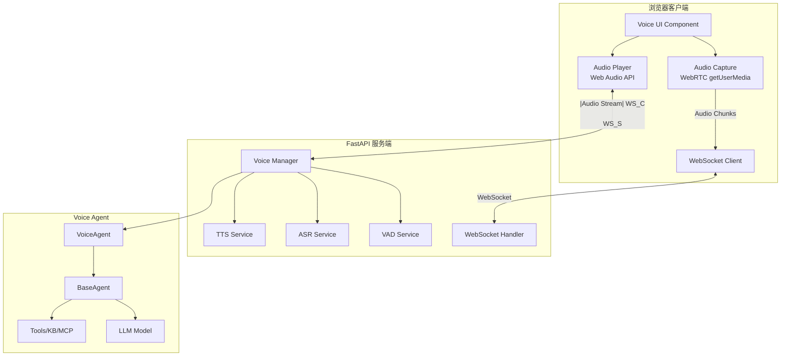
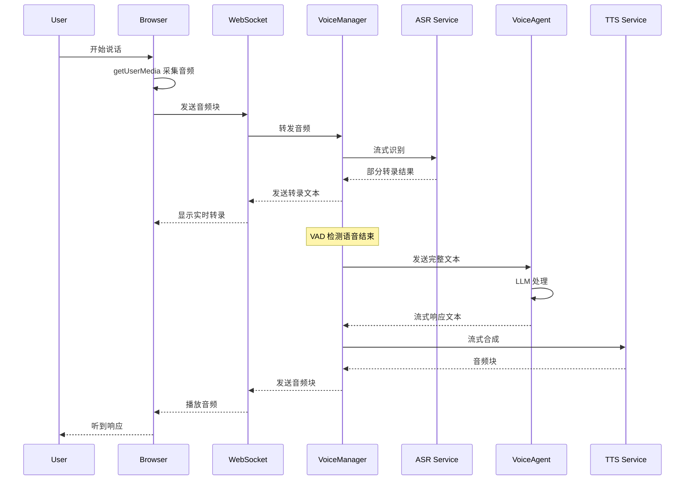

# Design Document: Voice Agent Interaction

## Overview

本设计文档描述语音智能体交互功能的技术架构和实现方案。该功能为 Yuxi-Know 平台添加实时语音交互能力，使用户能够通过语音与智能体进行自然对话。

### 核心设计目标

1. **低延迟**：首次响应延迟 < 500ms
2. **高质量**：利用浏览器内置的回声消除和降噪
3. **可扩展**：支持多种 ASR/TTS 提供商
4. **多端适配**：响应式 UI 适配大屏、PC、移动端

### 技术选型

| 组件 | 选型 | 理由 |
|------|------|------|
| ASR | OpenAI Whisper API / faster-whisper | 高准确率，支持中英文 |
| TTS | OpenAI TTS / Edge-TTS | 低延迟流式合成，自然语音 |
| VAD | Silero VAD | 轻量级，准确的语音活动检测 |
| 传输 | WebSocket | FastAPI 原生支持，实现简单 |
| 音频采集 | WebRTC getUserMedia | 内置回声消除、降噪 |
| 音频播放 | Web Audio API | 低延迟流式播放 |

## Architecture

### 系统架构图



### 数据流



## Components and Interfaces

### 后端组件

#### 1. VoiceAgent (src/agents/voice_agent/graph.py)

```python
class VoiceAgent(BaseAgent):
    """语音智能体，继承 BaseAgent 的所有能力"""
    
    name = "语音助手"
    description = "支持实时语音交互的智能体"
    capabilities = ["voice", "file_upload"]
    context_schema = VoiceContext
    
    async def get_graph(self) -> CompiledStateGraph:
        """构建语音智能体图"""
        pass
    
    async def process_voice_input(
        self, 
        text: str, 
        context: VoiceContext
    ) -> AsyncIterator[str]:
        """处理语音输入，返回流式文本响应"""
        pass
```

#### 2. VoiceContext (src/agents/voice_agent/context.py)

```python
@dataclass(kw_only=True)
class VoiceContext(BaseContext):
    """语音智能体配置上下文"""
    
    # ASR 配置
    asr_provider: Annotated[str, {...}] = field(
        default="openai",
        metadata={"name": "语音识别服务", "options": ["openai", "faster-whisper"]}
    )
    
    # TTS 配置
    tts_provider: Annotated[str, {...}] = field(
        default="openai",
        metadata={"name": "语音合成服务", "options": ["openai", "edge-tts"]}
    )
    tts_voice: str = field(default="alloy")
    tts_speed: float = field(default=1.0)
    
    # VAD 配置
    vad_threshold: float = field(default=0.5)
    silence_duration: float = field(default=0.8)
    
    # 交互配置
    interrupt_enabled: bool = field(default=True)
    tool_feedback_enabled: bool = field(default=True)
```

#### 3. ASR Service (src/services/voice/asr_service.py)

```python
class ASRService(Protocol):
    """ASR 服务接口"""
    
    async def transcribe_stream(
        self,
        audio_chunks: AsyncIterator[bytes],
        language: str = "auto"
    ) -> AsyncIterator[TranscriptionResult]:
        """流式语音识别"""
        ...

class OpenAIASRService:
    """OpenAI Whisper ASR 实现"""
    pass

class FasterWhisperASRService:
    """本地 faster-whisper ASR 实现"""
    pass
```

#### 4. TTS Service (src/services/voice/tts_service.py)

```python
class TTSService(Protocol):
    """TTS 服务接口"""
    
    async def synthesize_stream(
        self,
        text_chunks: AsyncIterator[str],
        voice: str,
        speed: float = 1.0
    ) -> AsyncIterator[bytes]:
        """流式语音合成"""
        ...

class OpenAITTSService:
    """OpenAI TTS 实现"""
    pass

class EdgeTTSService:
    """Edge TTS 实现（免费）"""
    pass
```

#### 5. VAD Service (src/services/voice/vad_service.py)

```python
class VADService:
    """语音活动检测服务"""
    
    def __init__(self, threshold: float = 0.5):
        self.model = self._load_silero_vad()
        self.threshold = threshold
    
    def detect_speech(self, audio_chunk: bytes) -> bool:
        """检测音频块是否包含语音"""
        pass
    
    def detect_speech_end(
        self, 
        audio_chunks: list[bytes],
        silence_duration: float
    ) -> bool:
        """检测语音是否结束"""
        pass
```

#### 6. Voice WebSocket Handler (server/routers/voice_router.py)

```python
@router.websocket("/ws/voice/{agent_id}")
async def voice_websocket(
    websocket: WebSocket,
    agent_id: str,
    token: str = Query(...)
):
    """语音 WebSocket 端点"""
    pass
```

### 前端组件

#### 1. VoiceAgentView (web/src/views/VoiceAgentView.vue)

主视图组件，包含语音交互界面。

#### 2. VoiceChat (web/src/components/voice/VoiceChat.vue)

语音聊天核心组件，管理音频采集、播放和 WebSocket 通信。

#### 3. AudioVisualizer (web/src/components/voice/AudioVisualizer.vue)

音频波形可视化组件。

#### 4. VoiceControls (web/src/components/voice/VoiceControls.vue)

语音控制按钮组件（开始/停止/静音）。

### WebSocket 消息协议

```typescript
// 客户端 -> 服务端
interface ClientMessage {
  type: 'audio' | 'control' | 'config';
  // audio 类型
  audio_data?: string;  // base64 编码的音频数据
  // control 类型
  action?: 'start' | 'stop' | 'interrupt';
  // config 类型
  config?: VoiceConfig;
}

// 服务端 -> 客户端
interface ServerMessage {
  type: 'transcription' | 'audio' | 'status' | 'error' | 'tool_call';
  // transcription 类型
  text?: string;
  is_final?: boolean;
  // audio 类型
  audio_data?: string;  // base64 编码的音频数据
  // status 类型
  status?: 'listening' | 'processing' | 'speaking' | 'idle';
  // error 类型
  error?: string;
  // tool_call 类型
  tool_name?: string;
  tool_status?: 'started' | 'completed' | 'failed';
}
```

## Data Models

### 数据库模型

语音会话复用现有的 Thread 模型，无需新增数据库表。

### 配置模型

```python
# saves/agents/voice_agent/config.yaml
system_prompt: "你是一个友好的语音助手..."
model: "gpt-4o-mini"
tools: []
knowledges: []
mcps: []
asr_provider: "openai"
tts_provider: "edge-tts"
tts_voice: "zh-CN-XiaoxiaoNeural"
tts_speed: 1.0
vad_threshold: 0.5
silence_duration: 0.8
interrupt_enabled: true
tool_feedback_enabled: true
```

### 音频格式

| 方向 | 格式 | 采样率 | 位深 | 通道 |
|------|------|--------|------|------|
| 客户端 -> 服务端 | PCM/WebM | 16kHz | 16bit | Mono |
| 服务端 -> 客户端 | MP3/PCM | 24kHz | 16bit | Mono |


## Correctness Properties

*A property is a characteristic or behavior that should hold true across all valid executions of a system—essentially, a formal statement about what the system should do. Properties serve as the bridge between human-readable specifications and machine-verifiable correctness guarantees.*

### Property 1: Voice Agent Inheritance

*For any* VoiceAgent instance, it SHALL be an instance of BaseAgent and have access to all base capabilities (tools, knowledges, mcps).

**Validates: Requirements 1.1**

### Property 2: Voice Processing Pipeline

*For any* audio input processed by VoiceAgent, the audio SHALL be passed through ASR_Service to produce text, and *for any* text response generated by the agent, it SHALL be passed through TTS_Service to produce audio.

**Validates: Requirements 1.4, 1.5**

### Property 3: Configuration Loading

*For any* valid VoiceConfig, when VoiceAgent is initialized with that config, all voice-specific settings (asr_provider, tts_provider, tts_voice, etc.) SHALL be correctly loaded and accessible.

**Validates: Requirements 1.2, 1.3**

### Property 4: Service Provider Factory

*For any* supported provider name (openai, edge-tts, faster-whisper), the ASR and TTS service factories SHALL create valid service instances that implement the required interface.

**Validates: Requirements 3.1, 4.1**

### Property 5: Streaming ASR Output

*For any* audio stream input, the ASR_Service SHALL return an async iterator that yields partial transcription results before the final result.

**Validates: Requirements 2.4, 3.2**

### Property 6: Streaming TTS Output

*For any* text input, the TTS_Service SHALL return an async iterator of audio chunks rather than waiting for complete synthesis.

**Validates: Requirements 2.5, 4.2**

### Property 7: VAD Speech Detection

*For any* audio containing both speech and silence segments, the VAD_Service SHALL correctly identify speech boundaries with accuracy above threshold.

**Validates: Requirements 3.6**

### Property 8: Interruption Handling

*For any* voice session where user speech is detected during TTS playback, the system SHALL: (1) detect the interruption, (2) stop TTS playback, (3) cancel pending TTS synthesis, and (4) process the new input normally.

**Validates: Requirements 5.1, 5.2, 5.3, 5.4**

### Property 9: Interruption Sensitivity

*For any* interruption sensitivity threshold value, the system SHALL use that threshold to determine when to trigger interruption detection.

**Validates: Requirements 5.5**

### Property 10: Session Lifecycle

*For any* voice session, starting the session SHALL create or resume a thread, and ending the session SHALL persist the conversation to the database.

**Validates: Requirements 6.1, 6.3**

### Property 11: Session History Compatibility

*For any* voice message in a session, it SHALL be stored in a format compatible with the existing thread system and retrievable through the same APIs.

**Validates: Requirements 6.2**

### Property 12: Session Timeout

*For any* voice session with a configured timeout duration, the session SHALL timeout after that duration of inactivity.

**Validates: Requirements 6.4**

### Property 13: Concurrent Sessions

*For any* set of concurrent voice sessions from different users, each session SHALL operate independently without interference.

**Validates: Requirements 6.6**

### Property 14: Config Persistence Round-Trip

*For any* valid VoiceConfig, saving it to YAML and loading it back SHALL produce an equivalent configuration.

**Validates: Requirements 7.5**

### Property 15: Audio Format Support

*For any* audio data in supported formats (PCM, WAV, WebM), the ASR_Service SHALL accept and process it without format errors.

**Validates: Requirements 9.2**

### Property 16: Tool Feedback Generation

*For any* tool invocation by VoiceAgent, the system SHALL generate appropriate audio feedback including tool name and status.

**Validates: Requirements 10.1, 10.2**

### Property 17: Tool Result Summarization

*For any* tool result, the system SHALL generate a natural speech summary of the result.

**Validates: Requirements 10.3**

### Property 18: Tool Feedback Verbosity

*For any* verbosity level setting, the tool feedback SHALL adjust its detail level accordingly.

**Validates: Requirements 10.4**

### Property 19: WebSocket Message Validation

*For any* WebSocket message received, the system SHALL validate the message format and reject invalid messages with appropriate error responses.

**Validates: Requirements 12.4**

### Property 20: Authentication Enforcement

*For any* voice-related endpoint request without valid authentication token, the system SHALL reject the request with 401 status.

**Validates: Requirements 12.5**

### Property 21: Exponential Backoff

*For any* sequence of service retries, the delay between retries SHALL follow an exponential backoff pattern.

**Validates: Requirements 11.4**

### Property 22: Error Logging Context

*For any* error logged by the system, the log entry SHALL include sufficient context (timestamp, session_id, user_id, error_type, stack_trace) for debugging.

**Validates: Requirements 11.6**

### Property 23: Full-Duplex Communication

*For any* voice session, the system SHALL support concurrent audio input and output without blocking either direction.

**Validates: Requirements 2.7**

### Property 24: TTS Voice Parameters

*For any* valid voice parameter combination (voice, speed, pitch), the TTS_Service SHALL produce audio with those characteristics.

**Validates: Requirements 4.3**

### Property 25: Special Content Handling

*For any* text containing special content (code blocks, URLs, numbers), the TTS_Service SHALL handle them without errors and produce reasonable speech output.

**Validates: Requirements 4.4**

### Property 26: Language Support

*For any* audio in Chinese or English, the ASR_Service SHALL correctly transcribe it and detect the language.

**Validates: Requirements 3.3**

### Property 27: Confidence Scores

*For any* transcription result, the ASR_Service SHALL include confidence scores.

**Validates: Requirements 3.4**

## Error Handling

### 错误类型与处理策略

| 错误类型 | 处理策略 | 用户反馈 |
|---------|---------|---------|
| ASR 服务不可用 | 降级到文本输入模式 | "语音识别暂时不可用，请使用文字输入" |
| TTS 服务不可用 | 仅显示文本响应 | "语音合成暂时不可用，已切换到文字模式" |
| WebSocket 断开 | 自动重连（指数退避） | "连接中断，正在重新连接..." |
| 麦克风权限被拒 | 显示权限申请指引 | "请允许麦克风权限以使用语音功能" |
| 音频格式不支持 | 尝试转换格式 | "音频格式不支持，请检查设备设置" |
| 会话超时 | 保存状态并关闭 | "会话已超时，对话已保存" |

### 重试策略

```python
async def retry_with_backoff(
    func: Callable,
    max_retries: int = 3,
    base_delay: float = 1.0,
    max_delay: float = 30.0
):
    """指数退避重试"""
    for attempt in range(max_retries):
        try:
            return await func()
        except Exception as e:
            if attempt == max_retries - 1:
                raise
            delay = min(base_delay * (2 ** attempt), max_delay)
            await asyncio.sleep(delay)
```

## Testing Strategy

### 测试方法

本功能采用双重测试策略：

1. **单元测试**：验证具体示例、边界情况和错误条件
2. **属性测试**：验证所有输入的通用属性

### 属性测试配置

- **测试库**：pytest + hypothesis
- **最小迭代次数**：100 次/属性
- **标签格式**：`Feature: voice-agent-interaction, Property {number}: {property_text}`

### 测试覆盖

| 组件 | 单元测试 | 属性测试 |
|------|---------|---------|
| VoiceAgent | 初始化、配置加载 | 继承验证、管道处理 |
| ASR Service | 各提供商实现 | 流式输出、格式支持、语言检测 |
| TTS Service | 各提供商实现 | 流式输出、参数处理、特殊内容 |
| VAD Service | 边界检测 | 语音检测准确性 |
| Voice Session | 生命周期 | 并发会话、超时处理 |
| WebSocket Handler | 消息处理 | 消息验证、认证 |
| Config | 保存/加载 | 配置往返一致性 |

### 关键测试场景

1. **端到端语音对话**：音频输入 → ASR → LLM → TTS → 音频输出
2. **打断处理**：用户在 TTS 播放时说话
3. **并发会话**：多用户同时使用语音功能
4. **错误恢复**：服务中断后的自动恢复
5. **配置热更新**：运行时更改配置

